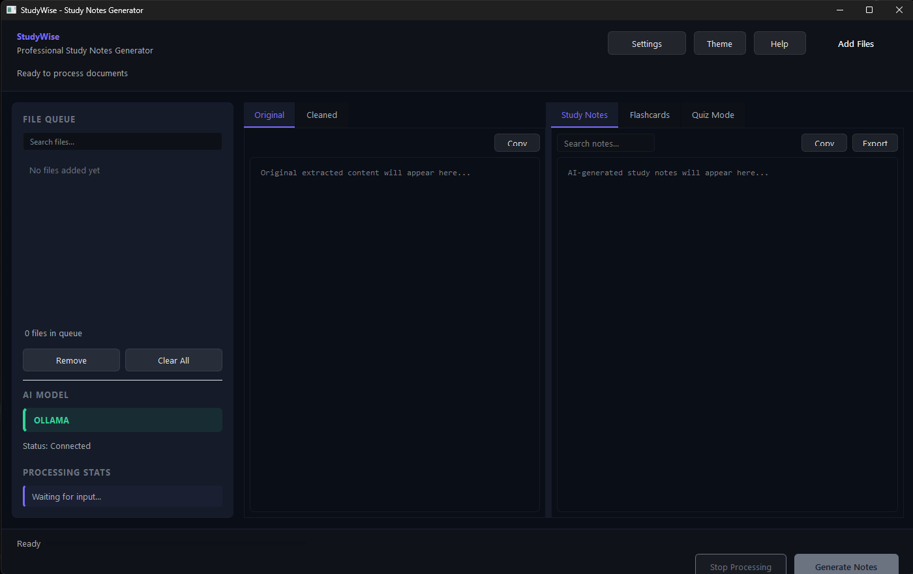

# StudyWise

**StudyWise** is a privacy-first desktop application that converts raw academic material into clean study notes, flashcards, and quizzes - all through a modern, distraction-free desktop interface.

It is built to be **fast, offline-capable**, and completely free from accounts, tracking, or vendor lock-in.

> Better notes. Better grades.

---

## Screenshot

> _Main StudyWise interface (Study Notes & Quiz workflow)_

## Demo Video

Short product walkthrough showcasing the StudyWise workflow

Watch the demo:

The video demonstrates:
Document import
Note generation
Flashcards & quiz mode
Offline local AI workflow

---

## Overview

StudyWise takes unstructured learning material - such as lecture PDFs, scanned notes, or documents - and transforms it into structured, exam-ready study resources.

The application runs locally by default and gives users full control over **how and where AI models are used**, making it suitable for privacy-conscious workflows and offline study environments.

---

## Features

### 📄 Document Processing
- Import PDF files (text-based or scanned)
- Extract text from PNG and JPG images using OCR
- Support for DOCX documents
- Automatic text cleaning and normalization
- Batch file handling with file-size display and progress tracking

### 🧠 Study Material Generation
- Generate structured study notes from raw content
- Automatically create flashcards from generated notes
- Convert flashcards into an interactive quiz mode

### 🤖 AI Integration
- Local model support via **Ollama** for offline usage
- Optional cloud model support (e.g. Google Gemini)
- Configurable model and provider settings inside the app
- No forced APIs, accounts, or subscriptions

### 📝 Quiz Mode
- Interactive flashcard-based practice
- Progressive answer reveal
- Correct and incorrect marking
- Score and progress tracking

### 📤 Export Options
- Export notes as **Markdown** or **plain text**
- Export flashcards as native **Anki (.apkg)** decks
- Copy notes and flashcards directly to the clipboard

---

## User Interface

- Desktop GUI built with **PySide6**
- Multi-tab workspace:
  - Original text
  - Cleaned text
  - Study notes
  - Flashcards
  - Quiz mode
- Drag-and-drop file support
- Keyboard shortcuts for common actions
- Real-time status updates and progress indicators
- Dark theme with accent-based styling

---

## Privacy & Offline-First Design

StudyWise is designed with a **local-first** philosophy.

- All files remain on the user’s machine by default
- No telemetry, analytics, or user accounts
- Internet access is only required if a cloud-based AI model is explicitly selected
- Fully functional offline workflow with local models

---

Installation & Requirements
System Requirements

Windows (x64)

Internet connection only if using cloud AI models

OCR Requirement (Important)

StudyWise relies on Tesseract OCR for processing scanned PDFs and images.

⚠️ You must install Tesseract OCR separately for OCR features to work.

Download Tesseract OCR (Windows):
https://github.com/UB-Mannheim/tesseract/wiki

During installation:

Make sure Tesseract is added to PATH

Restart your system after installation

If Tesseract is not installed, text-based PDFs will still work, but scanned documents and images will not be processed.

---

## Download

### Windows (x64)

**Direct download:**

https://github.com/realwarpie/studywise/releases/download/v0.1.0/StudyWise.exe

The application can be downloaded and run directly - no installer required.

---

## Technology Stack

- Python
- PySide6 (Qt for Python)
- OCR for scanned document processing
- Local and cloud large language model support

---

## Intended Users

- Students working with large volumes of lecture material
- Exam preparation workflows requiring fast summarization
- Users who prefer offline tools and strong data privacy
- Learners using external tools such as **Anki**, **Notion**, or **Obsidian**

---

## Project Status

- Early release - **v0.1.0**
- Actively tested and improved

---

## Author

**Ashwin**

---

Better notes. Better grades.
